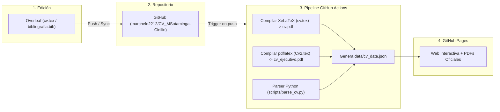

# Marcelo Sotaminga · Interactive AI-Ed Research Lab & CV Pipeline

Repositorio oficial para la gestión continua del CV académico/profesional de **Marcelo Javier Sotaminga Cinilin** con sincronización desde **Overleaf**, compilación automatizada en **LaTeX (XeLaTeX)** y generación de un **Research Portfolio interactivo desplegado en GitHub Pages**.

---

## 🌟 Arquitectura del Pipeline



---

## 🔬 Componentes de la Web Interactiva

1. **Header & Vista Dual**: Alterna entre el **Research Lab (Modo interactivo)** y el **CV Clásico estructurado**.
2. **Descarga Directa de PDFs**:
   - `CV_Marcelo_Sotaminga_Academico.pdf` (Compilación integral con XeLaTeX y fuentes tipográficas).
   - `CV_Marcelo_Sotaminga_Ejecutivo.pdf` (Versión ejecutiva resumida).
3. **Espacio Latente (Knowledge Graph Interactivo)**:
   - Motor Canvas 2D Force-Directed Graph a 60fps conectando tres dimensiones:
     - 🔵 **IA & Data Science**: Deep learning, modelos de diagnóstico cognitivo, ontologías y ecosistemas neuro-simbólicos.
     - 🟣 **Políticas Públicas & Dirección**: Gobernanza de tecnologías emergentes (MINTEL), ética de la IA (UNESCO), agendas digitales (BID, CEPAL, CAN).
     - 🟢 **Tecnopedagogía & Aprendizaje**: Jefatura de Producción Virtual en Unisabana, ecosistemas Moodle a gran escala, docencia superior y pensamiento computacional (OEI/Scratch).
4. **AI Feedback Assistant (Demo Viva)**:
   - Asistente inteligente en cliente inspirado en la publicación de Marcelo en *Springer 2026* (*Student Perceptions of an AI-Based Assistant for Formative Feedback*).
   - Responde preguntas sobre su tesis doctoral, roles institucionales y publicaciones indexadas.
5. **Timeline de Liderazgo & Docencia**:
   - Pestañas dinámicas para alternar entre gestión de proyectos y asignaturas impartidas en grado y posgrado.
6. **Biblioteca Científica (Research & Publications)**:
   - Extraída automáticamente de `bibliografia.bib`.
   - Filtros por cluster temático, enlaces a DOIs oficiales y botón para **Copiar BibTeX en 1 clic**.
7. **Proyectos Internacionales & Recursos Educativos Abiertos (REAs/OVAs)**:
   - Muestra proyectos con UNESCO, BID, MINEDUC, y enlaces a recursos educativos digitales como PreNatal, ALATA y Scratch Social.

---

## 🚀 Cómo agregar o enriquecer información

Para añadir nuevos enlaces, imágenes, demos o recursos educativos digitales sin tocar el código de la web, edita el archivo:

👉 `data/enrichment.json`

Permite configurar:
* **`projectEnrichments`**: Enlaces a demos, repositorios de GitHub, insignias o imágenes para proyectos específicos.
* **`digitalResources`**: Enlaces a OVAs, campus virtuales, canales de YouTube o cursos abiertos.
* **`aiAssistantKnowledge`**: Preguntas y respuestas adicionales para el asistente inteligente.

Tras editarlo, ejecuta:
```bash
python3 scripts/parse_cv.py
```
Y los cambios se integrarán automáticamente en `data/cv_data.json` y en la web.

---

## 💻 Ejecución y previsualización local

Para probar la web en tu computadora:

```bash
# 1. Parsear datos desde LaTeX
python3 scripts/parse_cv.py

# 2. Servir la web localmente
cd web && python3 -m http.server 8000
```
Abre en tu navegador: `http://localhost:8000`

---

## ⚙️ Configuración en GitHub Pages

Para habilitar el despliegue automático:
1. En GitHub, ve a **Settings** $\rightarrow$ **Pages** en este repositorio.
2. En **Build and deployment** $\rightarrow$ **Source**, selecciona: **GitHub Actions**.
3. Cada vez que hagas `push` desde Overleaf o desde tu terminal, el sitio se actualizará automáticamente.
